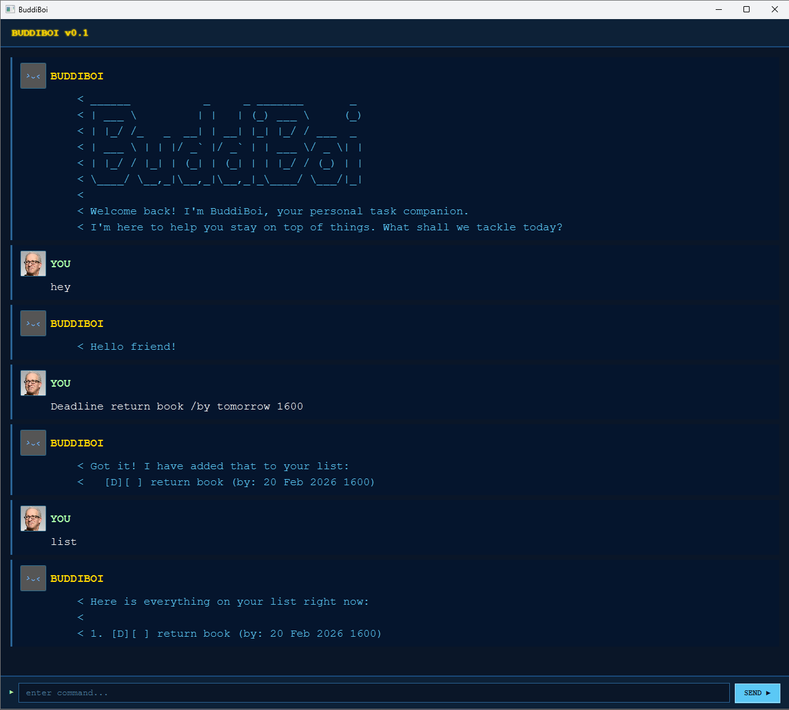

# BuddiBoi User Guide



## Introduction

**BuddiBoi** is a lightweight task management application with a friendly chat-based interface.
It allows you to manage todos, deadlines, and events efficiently using simple commands.

BuddiBoi is designed for users who prefer typing over clicking and want a fast way to manage tasks.

---

# Installation

1. Ensure you have Java `17` or higher installed. You can check via `java -version`
2. Download [BuddiBoi.jar](https://github.com/ojunyi/ip/releases)
3. Place `BuddiBoi.jar` in any empty folder
4. Open your terminal and navigate to that folder, then run `java -jar "BuddiBoi.jar"`
   > Alternatively, you can try running `BuddiBoi.jar` by double-clicking it, though this may not work on all systems.

If the launch is successful, you should see BuddiBoi greet you with an opening message.

---

# Command Summary

| Command | Format | Usage Example |
|---|---|---|
| Hello | `hello` / `hi` / `hey` | `hello` |
| Add Todo | `todo <description>` | `todo buy groceries` |
| Add Deadline | `deadline <description> /by <date>` | `deadline submit report /by today 1800` |
| Add Event | `event <description> /from <start> /to <end>` | `event team meeting /from tomorrow 1200 /to tomorrow 1300` |
| List Tasks | `list` | `list` |
| Mark Done | `mark <index>` | `mark 1` |
| Unmark Task | `unmark <index>` | `unmark 1` |
| Delete Task | `delete <index>` | `delete 1` |
| Find Tasks | `find <keyword>` | `find report` |
| Exit | `bye` / `goodbye` / `exit` / `quit` | `bye` |

> **Note:** Dates can also be written using natural language such as `today`, `tomorrow`, or day names like `Mon`, `Tue`, `Wed`, `Thu`, `Fri`, `Sat`, `Sun`.

---

# Known Issues

1. When writing a date using the day (i.e. Mon or Tue), the date parser takes the following day that you input. i.e. If today is a Wednesday, and you write Wed, it will assume you mean next Wednesday, not today's Wednesday. Therefore, assuming today is Wednesday, if you write `event test /from Wed /to Thu`, it will assume you mean the event is from next Wednesday to tomorrow's Thursday and will throw an error because that is not possible. Instead, write `event test /from Today /to Thu` or `event test /from Today /to Tomorrow`.
2. After calling `bye` and confirming whether you would like to save, there is a small delay before the application closes. This is intentional as `BuddiBoi` will first respond with a save confirmation message, followed by a farewell message, before the application fully exits.

---

# Features

## Greeting BuddiBoi

Say hello to BuddiBoi to get started!

**Command:** `hello` / `hi` / `hey`

**Example:**
```
hello
```

**Output:**
```
Hello friend! I'm BuddiBoi! What can I do for you?
```

---

## Adding a Todo task

Adds a simple task without any date or time attached.

**Command:** `todo <description>`

**Example:**
```
todo buy groceries
```

**Output:**
```
Got it! I have added that to your list:
  [T][ ] buy groceries
Now you have 1 task(s) in the list.
```

---

## Adding a Deadline task

Adds a task with a specific deadline.

**Command:** `deadline <description> /by <date>`

**Date Format:** `DD-MM-YYYY HHmm` (e.g. `19-02-2026 1800`) or natural language (e.g. `today 1800`, `tomorrow 1800`)

**Example:**
```
deadline submit report /by 19-02-2026 1800
deadline submit report /by today 1800
```

**Output:**
```
Got it! I have added that to your list:
  [D][ ] submit report (by: 19 Feb 2026 1800)
Now you have 2 task(s) in the list.
```

---

## Adding an Event

Adds a task with a start and end time.

**Command:** `event <description> /from <start> /to <end>`

**Date Format:** `DD-MM-YYYY HHmm` (e.g. `19-02-2026 1800`) or natural language (e.g. `today 1800`, `tomorrow 1800`)

**Example:**
```
event team meeting /from 20-02-2026 1200 /to 20-02-2026 1300
event team meeting /from tomorrow 1200 /to tomorrow 1300
```

**Output:**
```
Got it. I have added that to your list:
  [E][ ] team meeting (From: 20 Feb 2026 1200 To: 20 Feb 2026 1300)
Now you have 3 task(s) in the list.
```

---

## Listing All Tasks

Displays all tasks currently in your task list.

**Command:** `list`

**Example:**
```
list
```

**Output:**
```
Here is everything on your list right now:

1. [T][ ] buy groceries
2. [D][ ] submit report (by: 19 Feb 2026)
3. [E][ ] team meeting (From: 20 Feb 2026 1200 To: 20 Feb 2026 1300)
```

---

## Marking a Task as Done

Marks the task at the specified index as completed.

**Command:** `mark <index>`

**Example:**
```
mark 1
```

**Output:**
```
Wonderful work! I have marked that as complete:
  [T][X] buy groceries
```

---

## Unmarking a Task

Marks the task at the specified index as not yet completed.

**Command:** `unmark <index>`

**Example:**
```
unmark 1
```

**Output:**
```
No problem at all! I have unmarked that task for you:
  [T][ ] buy groceries
```

---

## Deleting a Task

Removes the task at the specified index from your task list.

**Command:** `delete <index>`

**Example:**
```
delete 1
```

**Output:**
```
Understood. I have removed that task for you:
  [T][ ] buy groceries
Now you have 2 task(s) in the list.
```

---

## Finding Tasks

Searches for all tasks whose descriptions contain the given keyword.

**Command:** `find <keyword>`

**Example:**
```
find report
```

**Output:**
```
Here is what I found for you:

1. [D][ ] submit report (by: 19 Feb 2026 1800)
```

---

## Exiting BuddiBoi

Exits the application. Goodbye!

**Command:** `bye` / `goodbye` / `exit` / `quit`

**Example:**
```
bye
```

**Output:**
```
It looks like you are ready to wrap up for now.
Would you like me to save your tasks before we go? (yes / no)
```
**Replying with yes**
```
Your tasks have been saved safely. They will be here waiting for you!
Thank you for using BuddiBoi. See you next time!
```
**Replying with anything other than yes**
```
Alright, your tasks have not been saved this time.
Thank you for using BuddiBoi. See you next time!
```
---
